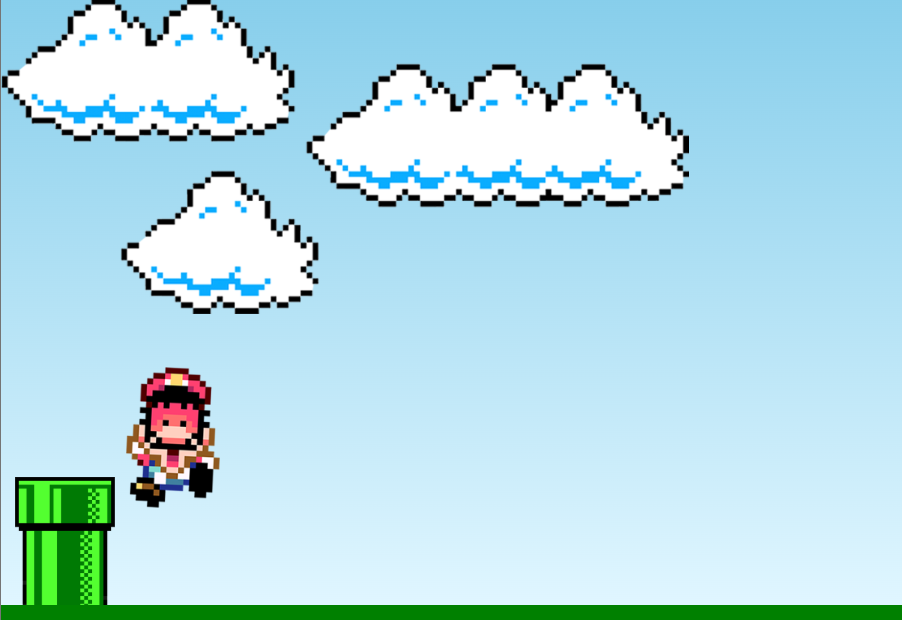

# 🍄 Mario Jump

> Jogo desenvolvido com **HTML**, **CSS** e **JavaScript** puro. Desvie dos canos pulando com qualquer tecla do teclado!



---

## 🎮 Como jogar

- Pressione **qualquer tecla** para o Mario pular
- Desvie do cano que vem em sua direção
- Se colidir com o cano o jogo acaba!

---

## ✨ Funcionalidades

- 🏃 Animação do Mario correndo
- 🌵 Cano se movendo automaticamente
- 💀 Detecção de colisão com game over
- ☁️ Cenário animado com nuvens

---

## 🛠️ Tecnologias utilizadas


---

## 📁 Estrutura do projeto

```
mario-jump/
├── index.html
├── css/
│   └── style.css
├── js/
│   └── script.js
└── imagens/
    ├── mario.gif
    ├── pipe.png
    ├── game-over.png
    └── preview.png
```

---

## 🚀 Como rodar localmente

```bash
git clone https://github.com/Nluan0/mario-jump.git
cd mario-jump
```

Abra o arquivo `index.html` no navegador e jogue!

---

## 📬 Contato

- GitHub: [@Nluan0](https://github.com/Nluan0)
- LinkedIn: [Natã Luan](https://www.linkedin.com/in/nat%C3%A3-luan-rodrigues-dos-santos-072145306/)
- 🔗 [Meu Linktree](https://linktree-nluan.vercel.app)

---

<p align="center">Feito com 💙 por <strong>Natã Luan</strong></p>
