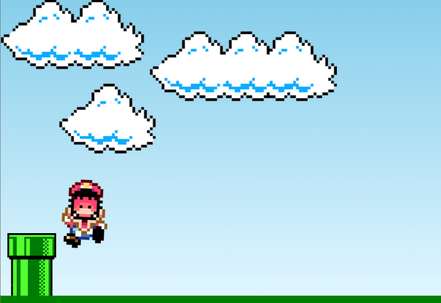

<div align="center">

</div>

<div align="center">

</div>

<br/>

<div align="center">
  
</div>

<br/>

<div align="center">

[](https://nluan0.github.io/mario-jump/)
[](https://github.com/Nluan0/mario-jump)
[](https://github.com/Nluan0/mario-jump)
[](https://github.com/Nluan0/mario-jump)

</div>

---

## 🕹️ Como jogar

- Pressione **qualquer tecla** para o Mario pular
- Desvie do cano que vem em sua direção
- Se colidir com o cano, o jogo acaba!

---

## ✅ Funcionalidades

- 🏃 Animação do Mario correndo
- 🌵 Cano se movendo automaticamente
- 💀 Detecção de colisão com game over
- ☁️ Cenário animado com nuvens

---

## 🛠️ Tecnologias

| Tecnologia | Uso |
|---|---|
| HTML5 | Estrutura do jogo |
| CSS3 | Animações e estilização |
| JavaScript | Lógica, colisão e controles |

---

## 📁 Estrutura do projeto
mario-jump/

├── index.html

├── css/

│   └── style.css

├── js/

│   └── script.js

└── imagens/

├── mario.gif

├── pipe.png

├── game-over.png

└── preview.png
---

## 🚀 Rodar localmente

```bash
git clone https://github.com/Nluan0/mario-jump.git
cd mario-jump
```
Abra o arquivo `index.html` no navegador e jogue!

---

## 📬 Contato

[](https://www.linkedin.com/in/nat%C3%A3-luan-rodrigues-dos-santos-072145306/)
[](https://github.com/Nluan0)
[](https://linktree-nluan0.vercel.app)

---

<div align="center">

</div>
